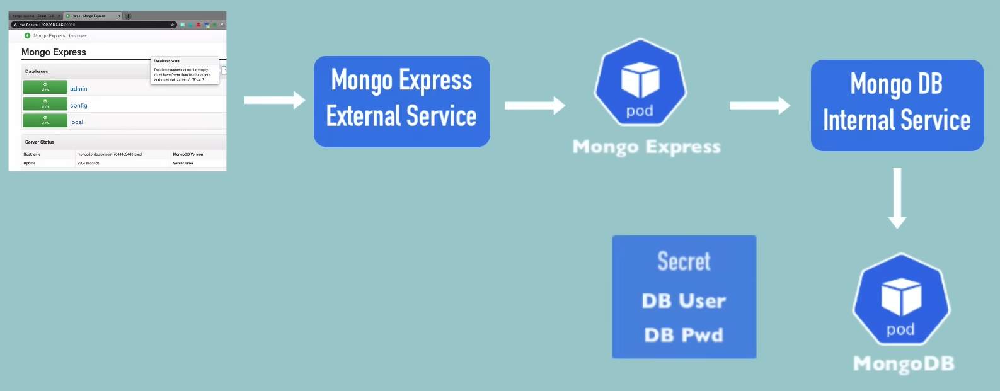

<h1 align='center'>
    Mongo Setup with Kubernetes
</h1>

<p align='center'>
    Example of a complete application setup with Kubernetes components.
</p>

<p align='center'>
    <a href="https://kubernetes.io">
        
    </a>
    &nbsp;
    <a href="https://www.mongodb.com">
        
    </a>
</p>

## Project Overview

This project demonstrates how to set up a MongoDB database along with a Mongo Express web interface using Kubernetes. The setup includes the necessary components such as Deployments, Services, ConfigMaps, and Secrets to manage the application effectively.

The project was inspired by the [video tutorial](https://youtu.be/X48VuDVv0do?si=Vmw9DeZeMTR0ZUD7&t=4577) from [TechWorld with Nana](https://www.youtube.com/@TechWorldwithNana) on YouTube and updated to the latest Kubernetes and MongoDB best practices.

## Prerequisites

To run this example, you need some prerequisites: 
- A Kubernetes cluster (local or cloud-based)
- `kubectl` installed and configured to interact with your cluster

In this example, we will use **Minikube** as our local Kubernetes cluster.

Ressources: 
- [Kubernetes installation guide](https://kubernetes.io/releases/download)
- [Minikube installation guide](https://minikube.sigs.k8s.io/docs/start/)

## Structure 

With this setup, we have the following components:

For the MongoDB part, we have:
- **Internal Service** : A MongoDB instance running inside a Kubernetes Pod.
- **ConfigMap** : A ConfigMap to store the DB Url. 
- **Secret** : A Secret to store DB User and DB Password.
- **Deployment** : A Deployment to manage the MongoDB Pod.

For the Mongo Express part, we have:
- **Deployment** : A Deployment to manage the Mongo Express Pod.
- **External Service** : An external service to expose the Mongo Express application.

## Flow Diagram

The following diagram illustrates the flow of data between the components:



## Installation 

To install and run the application, follow these steps:
1. Clone the repository:
2. Navigate to the project directory:
3. Update and apply the MongoDB Secret using environment variables for the username and password:
```bash
kubectl apply -f mongodb-secret.yaml
```
4. Apply the MongoDB ConfigMap:
```bash
kubectl apply -f mongodb-configmap.yaml
```
5. Deploy the MongoDB instance:
```bash
kubectl apply -f mongo.yaml
```
6. Deploy the Mongo Express application:
```bash
kubectl apply -f mongo-express.yaml
```
7. (Optional) If using Minikube, expose the Mongo Express service:
```bash
minikube service mongo-express-service
```
8. Access the Mongo Express web interface using the URL provided by Minikube (you need to log in with the credentials defined in the Secret).

## Cleanup

To clean up the resources created by this setup, run the following commands:
```bash
kubectl delete -f mongo-express.yaml
kubectl delete -f mongo.yaml
kubectl delete -f mongodb-configmap.yaml
kubectl delete -f mongodb-secret.yaml
```